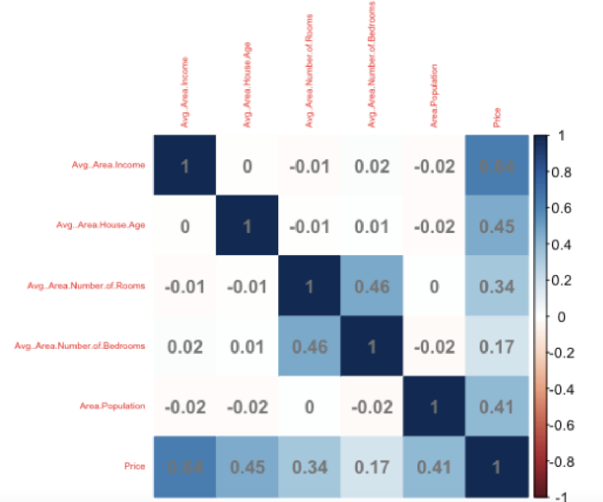

## Project1: Regression Analysis of Housing Prices
* Collaborators: Luis Osorio, Richard Diazdeleon, Victor Chen
* Date: September 5, 2023

resize:

## Introduction
The project utilizes the USA Housing dataset from Kaggle to analyze various factors affecting housing prices across different cities in the United States. The dataset comprises 5000 rows and 7 columns, featuring variables such as average income, house age, number of rooms, and population. The aim is to identify significant predictors of housing prices, thereby aiding potential homeowners in making informed decisions.

## Research Questions
* What combination of features (income, age of houses, number of rooms, and number of bedrooms) are statistically significant in predicting the selling price of a house?
* Is the reduced or full linear regression model best suited to predict housing prices?
* What is the average house price in the U.S. under specific conditions (e.g., average income of $50,000, house age of 5 years, etc.)?

## Methodology
* Data Exploration: Conducted exploratory data analysis to identify potential predictors.
* Statistical Tests: Utilized t-tests and F-tests for variable selection.
* Model Fitting: Employed linear regression models, checking for LINE assumptions (Linearity, Independence, Normality, Equal variance).
* Model Comparison: Used step-wise regression with AIC and BIC metrics to finalize the model.

## Key Findings
Significant Predictors: Average income, house age, and number of rooms were found to be significant.
Best Model: The reduced model without the 'Average Number of Bedrooms' was statistically better.
Predictive Power: The final model was used to predict an average house price of $531,319 under specific conditions, with a 95% confidence interval of [$524,410 : $538,227].

##  R Code and Libraries Used
* R Version: 4.3.1
* Libraries: tidyverse, MASS, glmnet, ggplot2, corrplot

## Future Work
Incorporate local factors like zip codes for a more granular analysis.
Explore the impact of external market variables like inflation rates.

## References
PowerPoint [https://github.com/dsrichard97/portfolio/blob/main/Presentation.pptx]
USA Housing Dataset on Kaggle [
(https://www.kaggle.com/datasets/vedavyasv/usa-housing)https://www.kaggle.com/datasets/vedavyasv/usa-housing]
